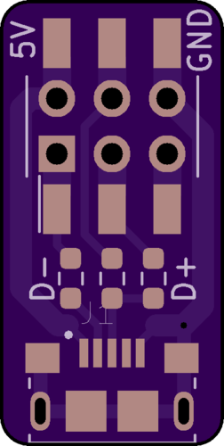

# SPI2USB

This is a USB adapter for the EK-10M08E144 MAX 10 Evaluation Kit.  
It adds a micro USB connector by connecting to the SPI connector J11.

 

[Schematic](spi2usb-sch.pdf)

## BOM 

 * [Micro USB Connector: 10118193-0001LF](https://www.mouser.com/ProductDetail/649-10118193-0001LF)
 * [2x 24 Ohm 0603 Thick Film Resistor: RC0603FR-0724RL](https://www.mouser.com/ProductDetail/603-RC0603FR-0724RL)
 * [1.5K Ohm 0603 Thick Film Resistor: RC0603FR-7W1K5L](https://www.mouser.com/ProductDetail/603-RC0603FR-7W1K5L)
 * [2x3 SMT Bottom Entry Socket: HLE-103-02-F-DV-BE-TR](https://www.mouser.com/ProductDetail/200-HLE10302FDVBETR) (optional)
